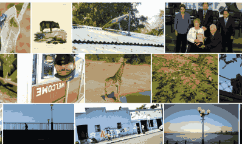
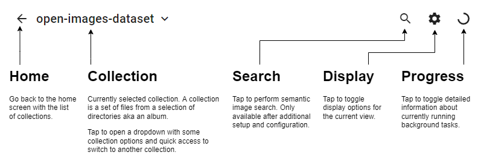
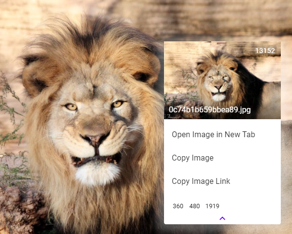

<!-- HEADER -->
<br />
<p align="center">
  <a href="https://github.com/othneildrew/Best-README-Template">
    
  </a>

  <h3 align="center">Photofield</h3>

  <p align="center">
    Experimental <em>fast</em> photo viewer.
    <br />
    <br />
    <a href="https://github.com/SmilyOrg/photofield/issues">Report Bug</a>
    ·
    <a href="https://github.com/SmilyOrg/photofield/issues">Request Feature</a>
  </p>
</p>


<!-- TABLE OF CONTENTS -->
<details open="open">
  <summary>Table of Contents</summary>
  <ol>
    <li>
      <a href="#about">About</a>
      <ul>
        <li><a href="#features">Features</a></li>
        <li><a href="#limitations">Limitations</a></li>
        <li><a href="#built-with">Built With</a></li>
      </ul>
    </li>
    <li><a href="#getting-started">Getting Started</a></li>
    <li><a href="#configuration">Configuration</a></li>
    <li><a href="#usage">Usage</a></li>
    <li><a href="#maintenance">Maintenance</a></li>
    <li><a href="#development-setup">Development Setup</a></li>
    <li><a href="#contributing">Contributing</a></li>
    <li><a href="#license">License</a></li>
    <li><a href="#acknowledgements">Acknowledgements</a></li>
  </ol>
</details>


## About


_Zoom to logo within a sample of 43k images from [open-images-dataset], i7-5820K 6-Core CPU, NVMe SSD_

Photofield is a photo viewer built to mainly push the limits of what is possible
in terms of the number of photos visible at the same time and at the speed at
which they are displayed. The goal is to be as fast or faster than Google Photos
on commodity hardware while displaying more photos at the same time. It is
non-invasive and at this point meant to be used to complement other photo
gallery software.


### Features

* **Seamless zoomable interface**. Thanks to tiled image loading supported by
[OpenLayers] and the API implementing tile rendering, you can switch between
levels of detail seamlessly without loading a special detailed or
fullscreen view.



* **Progressive multi-resolution loading**. Not only are thumbnails used to show
a single photo quicker, the whole layout is progressively loaded, so even if you
move through photos quickly or zoom around, you will almost always have some
form of feedback to not lose track.


* **Different layouts**. Collections of photos can be displayed with different
layouts.

  * **Album:** chronological photos grouped by event
  * **Timeline:** reverse-chronological timeline similar to Google Photos
  * **Wall:** a square collage of all the photos, because zooming is fun!
  * [More future ideas?](https://github.com/SmilyOrg/photofield/issues/1)
* **Semantic search using [photofield-ai] (alpha)**. If you set up an AI server
  and configure it in the `ai` section of the [configuration], you should be
  able to search for photo contents using words like "beach sunset", "a couple
  kissing", or "cat eyes".
  
* **Reuse of existing thumbnails**. Do you have hundreds of gigabytes of
  existing thumbnails from an existing system? Me too! Let's just reuse those.
  Here are the currently supported thumbnail sources:
  * Synology Moments / Photo Station auto-generated thumbnails in `@eaDir`.
  * Embedded JPEG thumbnails (`ThumbnailImage` Exif tag).
  * Limited support for extension via `thumbnails` section of
    the [Configuration].
  * Please [open an issue] for other systems, bonus points for an idea on how to
    integrate!
* **Single file binary**. Thanks to [Go] and [GoReleaser], all the dependencies
are packed into a [single binary file](#binaries) for most major OSes.
* **Read-only file system based collections**. Photofield never changes your
photos, thumbnails or directories. You are encouraged to even mount your photos
as read-only to ensure this. The file system is the source of truth, everything
else is just a more or less stale cache.
* **Fast indexing**. Thanks to [godirwalk], file indexing practically runs at
the speed of the file system 1000-10000 files/sec on fast SSD and hot cache.
EXIF metadata and [prominent color] are extracted as separate follow-up
operations and run at up to ~200 files/sec and ~1000 files/sec on a fast system.
* **Basic video support**. Videos are supported, however the user experience
is not great yet as there are some usability quirks. Different resolutions are
supported if they have been previously transcoded, but there is no on-the-fly
transcoding supported right now.

### Limitations

* **No thumbnail generation**. Only pre-generated thumbnails are supported.
* **No photo details (yet)**. There is no way to show metadata of a photo in the
UI at this point.
* **Not optimized for many clients**. As a lot of the normally client-side
state is kept on the server, you will likely run into CPU or Memory problems
with more than a few simultaneous users.
* **No user accounts**. Not the focus right now. You can define separate
collections for separate users based on the directory structure, but there is no
authentication or authorization support.
* **Initial load can be slow**. All the photos need to be laid out when you
first load a page in a specific window size and configuration, which can take
some time with a slow CPU and cold HDD cache.
* **No permalinks**. Deep linking to images works, but it's currently not stable
over time as IDs can change. 

### Built With

* [Go] - API and server-side tile rendering
* [Canvas (tdewolff)](https://github.com/tdewolff/canvas) - vector rendering in
  Go
* [SQLite 3 (zombiezen)](https://github.com/zombiezen/go-sqlite) -
  fast single-file database/cache
* [Vue 3] - frontend framework
* [BalmUI] - Material UI components
* [OpenLayers] - in-browser tiled image rendering
* [OpenSeadragon] (honorary mention) - tiled image rendering library used previously
* [+ more Go libraries](go.mod)
* [+ more npm libraries](ui/package.json)


## Getting Started

### Docker

Make sure you create an empty `data` directory in the working directory and that
you put some photos in a `photos` directory.

```sh
docker run -p 8080:8080 -v "$PWD/data:/app/data" -v "$PWD/photos:/app/photos:ro" ghcr.io/smilyorg/photofield
```

The cache database will be persisted to the `data` dir and the app should be
accessible at http://localhost:8080. It should show the `photos` collection by
default. For further configuration, create a `configuration.yaml` in the
`data` dir.

<details>
  <summary><code>docker-compose.yaml</code> example</summary>
  
  This example binds the usual Synology Moments photo directories and assumes
  a certain path structure, modify to your needs graciously. It also assumes you
  have configured the `/photo` and `/user` directories as collections in
  the `configuration.yaml`.
  ```yaml
  version: '3.3'
  services:

    photofield:
      image: ghcr.io/smilyorg/photofield
      ports:
        - 8080:8080
      volumes:
        - /volume1/docker/photofield/data:/app/data
        - /volume1/photo/:/photo:ro
        - /volume1/homes/ExampleUser/Drive/Moments:/exampleuser:ro
  ```
</details>

### Binaries

1. [Download and unpack a release].
2. Run `./photofield` or double-click on `photofield.exe` to start the server.
3. Open http://localhost:8080, folders in the working directory will be
displayed as collections. 🎉

* 📝 Create a `configuration.yaml` in the working dir to configure the app
* 🕵️‍♀️ Install [exiftool] and add it to PATH for better metadata support
(esp. for video)
* ⚪ Set the `PHOTOFIELD_DATA_DIR` environment variable to change the path where
the app looks for the `configuration.yaml` and cache database

[Download and unpack a release]: https://github.com/SmilyOrg/photofield/releases
[exiftool]: https://exiftool.org/


## Configuration

You can configure the app via `configuration.yaml`.

The location of the file depends on the installation method, see
[Getting Started].

The following is a minimal `configuration.yaml` example, see [`defaults.yaml`]
for all options.

```yaml
collections:
  # Normal Album-type collection
  - name: Vacation Photos
    dirs:
      - /photo/vacation-photos

  # Timeline collection (similar to Google Photos)
  - name: My Timeline
    layout: timeline
    dirs:
      - /photo/myphotos
      - /exampleuser

  # Create collections from sub-directories based on their name
  - expand_subdirs: true
    expand_sort: desc
    dirs:
      - /photo
```


## Usage

This section will cover some obvious uses, but also some possibly unintuitive UI
quirks that exist in the current version. 

### App Bar


### Photo Viewer

* Click to zoom to a photo
  * `Escape` or pinch out to get back to the list of photos
* Zoom in/out directly with `Ctrl/Cmd`+`Wheel`
* Pinch-to-zoom on touch devices
* Press/hold `Arrow Left` or `Arrow Right` to quickly switch between photos
* Right-click or long-tap as usual to open a custom context menu allowing you to
  copy or download original photos or thumbnails.
  
  
  
  _You can open/copy/copy link the original or access any existing thumbnails
  that already exist for it with the bottom list of thumbnails by pixel width._


## Maintenance

Over time the cache database can grow in size due to version upgrades and so on.
To shrink the database to its minimum size, you can _vacuum_ it. Multiple vacuums in a row have no effect as the vacuum itself rewrites the database from
the ground up.

While the vacuum is in progress, it will take twice the database size and may
take several minutes if you have lots of photos and a low-power system.

As an example it took around 5 minutes to vacuum a 260 MiB database containing around 500k photos on a DS418play. The size after vacuuming was 61 MiB as all the
leftover data from database upgrades was cleaned up.

```sh
# CLI
./photofield -vacuum

# Docker
docker exec -it photofield ./photofield -vacuum
```

## Development Setup

### Prerequisites

* [Go] - for the backend / API server
* [Node.js] - for the frontend
* [just] - to run common commands conveniently
* [watchexec] - for auto-reloading the Go server
* sh-like shell (e.g. sh, bash, busybox) - required by `just`
* [exiftool] - for testing metadata extraction

**[Scoop] (Windows)**: `scoop install busybox just exiftool watchexec`

### Installation

1. Clone the repo
   ```sh
   git clone https://github.com/smilyorg/photofield.git
   ```
2. Install Go dependencies
   ```sh
   go get
   ```
3. Install NPM packages
   ```sh
   cd ui
   npm install
   ```

### Running

Run both the API server and the UI server in separate terminals. They are set
up to work with each other by default with the API server running at port `8080`
and the UI server on port `3000`.

`just` is [just] as defined in the [prerequisites](#prerequisites).

#### API

* `just watch` the source files and auto-reload the server using [watchexec]
* or `just run` the server

#### UI

* `just ui` to start a hot-reloading development server
* or run from within the `ui` folder
  ```sh
  cd ui
  npm run dev
  ```


## Contributing

Pull requests are welcome. For major changes, please open an issue first to
discuss what you would like to change.


## License

Distributed under the MIT License. See `LICENSE` for more information.


## Acknowledgements
* [Open Images Dataset][open-images-dataset]
* [Best-README-Template](https://github.com/othneildrew/Best-README-Template)
* [readme.so](https://readme.so/)

[Configuration]: #configuration

[open an issue]: https://github.com/SmilyOrg/photofield/issues
[Getting Started]: #getting-started
[`defaults.yaml`]: defaults.yaml

[open-images-dataset]: https://opensource.google/projects/open-images-dataset

[Scoop]: https://scoop.sh/
[just]: https://github.com/casey/just
[watchexec]: https://github.com/watchexec/watchexec

[Go]: https://golang.org/
[GoReleaser]: https://github.com/goreleaser/goreleaser
[godirwalk]: https://github.com/karrick/godirwalk
[prominent color]: https://github.com/EdlinOrg/prominentcolor

[OpenLayers]: https://openlayers.org/
[OpenSeadragon]: https://openseadragon.github.io/
[Node.js]: https://nodejs.org/
[Vue 3]: https://v3.vuejs.org/
[BalmUI]: https://next-material.balmjs.com/
[photofield-ai]: https://github.com/smilyorg/photofield-ai
