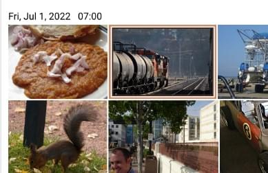

# Layouts

Photofield supports various layouts to display collections of photos. Each
layout offers a unique way to organize and view your photos.

You can set the default layout for each collection in the
[configuration](../configuration), or change the currently displayed layout
through the cog icon in the top right corner.

## Sorting

Photos can be sorted in different ways:

* **Date (Ascending/Descending)** - Sort photos chronologically
* **Shuffle** - Randomize the order of photos with deterministic shuffles that change at specified intervals:
  * **Hourly** - New shuffle every hour
  * **Daily** - New shuffle every day
  * **Weekly** - New shuffle every week
  * **Monthly** - New shuffle every month

Shuffle sorting is useful for rediscovering forgotten photos in your collection. Each shuffle is deterministic, meaning the same time period always produces the same order. The scene automatically updates with a new shuffle when the time interval changes, either on page refresh or when the browser regains focus.

When shuffle is active, date and time information is hidden since photos are no longer in chronological order.

You can configure the default sort order in the [configuration](../configuration) or change it dynamically through the display settings (cog icon).

## Album

The **Album** layout groups photos chronologically by event. This layout is
ideal for organizing photos from different events or occasions.

## Timeline

The **Timeline** layout displays photos in a reverse-chronological order,
similar to Google Photos. This layout is useful for viewing recent photos first.

## Wall

The **Wall** layout creates a square collage of all the photos. This layout is
great for quickly browsing through a large number of photos.

## Map

The **Map** layout places all the photos on a map. This layout is perfect for
finding photos taken at specific locations.

## Flex

The **Flex** layout uses a variant of Knuth & Plass algorithm to create a
smarter layout, especially for photos with odd aspect ratios.

## Highlights

The **Highlights** layout varies the row height based on the "sameness" of the
photos. This layout is designed to make travel photo collections more skimmable
by shrinking similar and repeating photos. This layout requires AI to be enabled.

