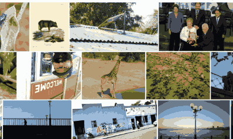
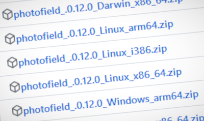
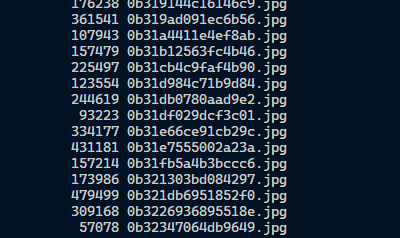
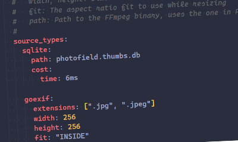
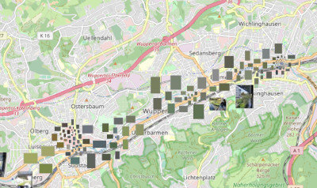
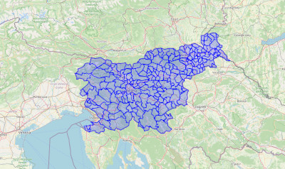
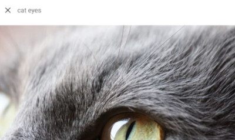
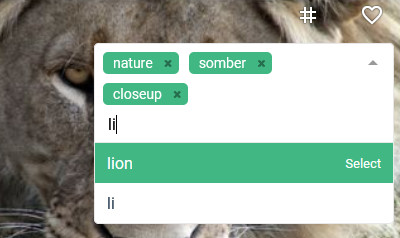

---
# https://vitepress.dev/reference/default-theme-home-page
layout: home

hero:
  name: "Photofield"
  text: Self-Hosted Personal Photo Gallery
  tagline: |
    A non-invasive local photo viewer with a focus on speed and simplicity.

  actions:
    - theme: brand
      text: Quick Start
      link: /quick-start
    - theme: alt
      text: Documentation
      link: /docs
    - theme: alt
      text: Demo
      link: https://demo.photofield.dev/

features:
  - title: |
      
      Seamless zoomable interface
    details: |
      Every view is zoomable if you ever need to see just a little more detail.

  - title: |
      
      Progressive multi-resolution loading
    details: |
      The whole layout is progressively loaded from a low-res preview to a full quality photo.

  - title: |
      
      Simple to run
    details: |
      All the dependencies are packed into a single executable for Windows, Linux, and macOS. Just download and run. Docker images are also available.

  - title: |
      Open Source (MIT)
    link: /contributing
    details: |
      The source code is available on GitHub. Contributions are welcome.
      
  - title: |
      
      Non-destructive
    details: |
      Your files and directories are treated as an untouchable source of truth and are never modified. You can even use a read-only mount.

  - title: |
      
      Fast indexing
    details: |
      Files are indexed practically at the speed of the file system at up to 10000 files/sec. Additional details are extracted as follow-up operations at up to 1000 files/sec.

  - title: |
      
      Flexible media system
    details: |
      Reuse hundreds of gigabytes of existing thumbnails or just let optimized versions be generated automatically to speed up display.

  - title: |
      
      Different views
    details: |
      Collections of photos can be displayed with different layouts, like an album, a timeline, or a map.

  - title: |
      
      Reverse geolocation
    details: |
      Local, embedded reverse geolocation, negligible performance impact, no API calls needed. Supports ~50 thousand places powered by geoBoundaries.

  - title: |
      
      Semantic search (alpha)
    details: |
      You can search for photo contents using words like "beach sunset", "a couple kissing", or "cat eyes". Needs to be configured as it requires running a separate AI server.

  - title: |
      
      Tags (alpha)
    details: |
      You can tag photos with arbitrary tags, which are only stored in the database and not in the photos themselves. Needs to be enabled in the configuration.

  - title: |
      
      Basic video support
    details: |
      Videos are supported, however there are some usability quirks. Previously transcoded resolutions are supported, but there is no support for on-the-fly transcoding right now.

---

<Background src="assets/background.jpeg" />
