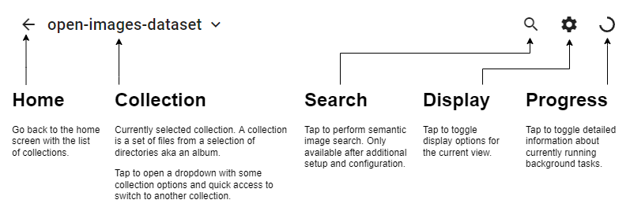
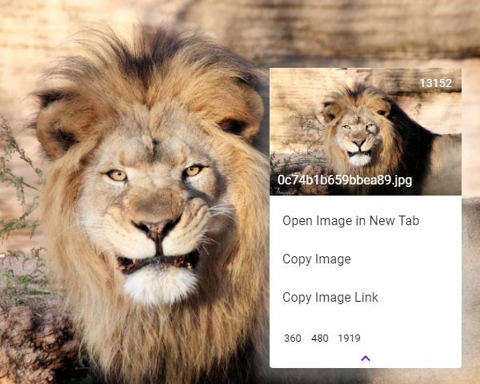

# User Interface

## App Bar

## Photo Viewer

* Click to zoom to a photo
  * `Escape` or pinch out to get back to the list of photos
* Zoom in/out directly with `Ctrl/Cmd`+`Wheel`
* Pinch-to-zoom on touch devices
* Press/hold `Arrow Left` or `Arrow Right` to quickly switch between photos
* Right-click or long-tap as usual to open a custom context menu allowing you to
  copy or download original photos or thumbnails.
  
  
  
  _You can open/copy/copy link the original or access any existing thumbnails
  that already exist for it with the bottom list of thumbnails by pixel width._

